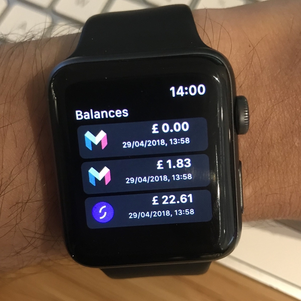

# Welcome to SaveIt 👋💸
SaveIt is a quick alternative to have a look into your balances from the major banks in the UK on your iPhone and/or your Apple Watch. This has been done by using [Open Banking APIs](https://www.openbanking.org.uk/).

|||
|:-:|:-:|
|  |  |

🚀*At this moment the project is just an experiment and it is working, with ___limitations___, with Monzo and Starling developer accounts only. I do have plans to integrate with Revolut, Lloyds and HSBC if possible in the near future.*

## Purpose 🤓

I'm an Apple Watch aficionado, who uses the watch in every opportunity I can. I believe it saves a lot of time by, for instance, take the bus or the tube in London and pay with apple pay with your watch instead using your phone or an [Oyster card](https://tfl.gov.uk/fares-and-payments/oyster).

Given that, I think it would be super useful and cool to have __my current account balances on Apple Watch__. Not only a simple single view application, but also show the balances as [complications](https://developer.apple.com/library/content/documentation/General/Conceptual/WatchKitProgrammingGuide/index.html#//apple_ref/doc/uid/TP40014969-CH8-SW6) in the watch face.

## To run the project 🏃‍
- `sudo gem install bundler`
- `bundle install`
- `pod install`
- Rename `configuration_example.plist` file to `configuration.plist`
- Add your secrets and tokens from [Monzo](https://developers.monzo.com/) and [Starling](https://developer.starlingbank.com/) to `configuration.plist`

For the branching strategy the project uses `git flow` and for CI it will use a `Jenkins` pipeline together with `fastlane`.

## Speaking about pipelines... 🚀
For a long time now, [Fastlane](https://fastlane.tools/) is the bomb. I've been running the lanes in a macOS virtual machine with Jenkins and Sonar, as I'll explain soon in a Medium article. One of my favourite things to do is to run some metrics in the codebase. You could try by running `fastlane metrics` and it will execute:
- Fastlane [Scan](https://docs.fastlane.tools/actions/scan/)
- [Slather](https://github.com/SlatherOrg/slather)
- [Lizard](https://github.com/terryyin/lizard)
- [SwiftLint](https://github.com/realm/SwiftLint)
- [Sonar](https://www.sonarsource.com/) with an open source [swift plugin](https://github.com/Backelite/sonar-swift)
